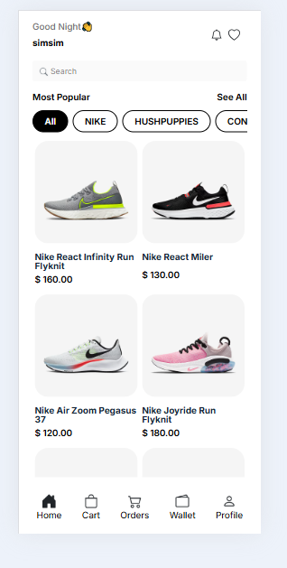
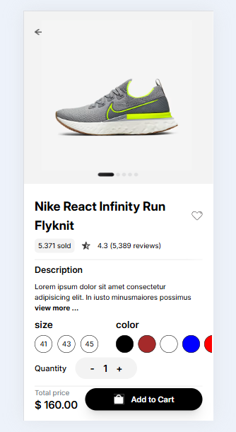
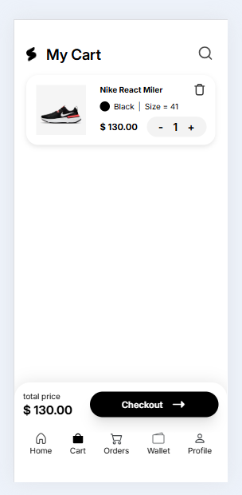
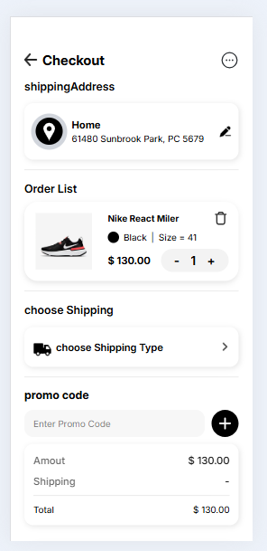

# 🛍 Shoe Shop

A modern and responsive e-commerce website built with Vanilla JavaScript.

## 📖 About

Shoe Shop is a frontend e-commerce project that allows users to browse
products, search for items, view product details, and manage their
shopping cart through a clean and responsive interface.

This project was built to strengthen my JavaScript skills and gain
practical experience in building real-world web applications.

---

## ✨ Features

- 📱 Responsive Design
- 🛍 Product Listing
- 🔍 Product Search
- 👟 Product Details
- 🛒 Shopping Cart
- 💾 Local Storage
- ❤️ Wishlist
- 📦 Product Categories
- 🎨 Clean and Modern UI

---

## 🛠 Tech Stack

- HTML5
- CSS3
- JavaScript
- Local Storage
- Git & GitHub

---

### 🏠 Home Page

<p align="center">
  
</p>

---

### 👟 Products

<p align="center">
  
</p>

---

### 🛒 Shopping Cart

<p align="center">
  
</p>

---

### 💳 Checkout

<p align="center">
  
</p>
---

## 🚀 Live Demo

[View Live Demo](https://YOUR_VERCEL_LINK)

---

## 💻 Installation

Clone the repository:

```bash
git clone https://github.com/simaeskandari80-alt/shoeshop.git
